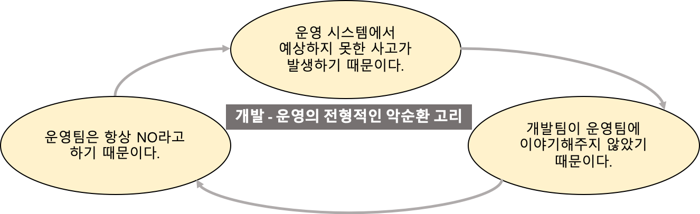

# DevOps

# DevOps 란

---

### Development (개발) + Operations (운영) 의 합성어 로 시작함

→ 이제는 개발+운영 만을 의미하는 것은 아님

→ 철학, 방법론으로 여러가지 해석과 방법이 존재함

> by wikipedia
> 
> 
> "개발"과 "운영"에 대한 용어와 개념의 교차 기능 조합(및 합성어 ) 이라는 점 외에 학계와 실무자는 "DevOps"라는 용어에 대한 보편적인 정의를 개발하지 않았습니다. 대부분의 경우 DevOps는 공유 소유권, 워크플로 자동화 및 신속한 피드백과 같은 주요 원칙을 특징으로 합니다.
> 
> 그러나 이 용어는 여러 상황에서 사용됩니다. 가장 성공적인 DevOps는 특정 관행, 문화 변화 및 도구의 조합입니다. 
> 

역사적 관점에서

> 2009년 오렐리 벨로시티에서 열린 컨퍼런스에서 플리커의 존과 폴이 데브옵스의 초기 개념을 담은 “`10+ Deploys per Day: Dev & Ops Cooperation at Flickr`” 를 발표하였는데, 이 프리젠테이션에서 영감을 얻은 패트릭 드보아가 벨기에 겐트(Ghent) 지역에서 [DevOpsdays 컨퍼런스](https://devopsdays.org/events)를 개최하면서 공식적으로 “**DevOps**“라는 용어가 공식적으로 쓰이기 시작했습니다.
> 
> 
> 아래는 플리커의 devopsday 발표 자료에 나오는 것으로 개발-운영간 갈등을 나태냅니다.
> 



참고 : [https://engineering-skcc.github.io/devops/DevOps1-애자일과데브옵스/](https://engineering-skcc.github.io/devops/DevOps1-%EC%95%A0%EC%9E%90%EC%9D%BC%EA%B3%BC%EB%8D%B0%EB%B8%8C%EC%98%B5%EC%8A%A4/)

(방법론 으로서 발달해온 DevOps 라는 용어 대해 역사적흐름을 통해 설명해 놓았습니다. 애자일과 devops 에 대한 필자의 생각이 꼼꼼하게 정리되어있는 것 같아 개념이해에 도움이 될 것 같습니다.)

> by Redhat
'DevOps'는 'development(개발)'와 'operations(운영)'가 합쳐진 단어이지만, 단순히 각각의 용어를 결합한 것 이상의 포괄적인 아이디어와 방식을 나타냅니다. DevOps에는 보안, 협업 방식, 데이터 분석을 비롯해 기타 여러 요소가 포함됩니다. 그렇다면 DevOps가 구체적으로 무엇을 의미하는 것일까요?
DevOps는 하나의 아이디어(새로운 소프트웨어 기능, 개선 요청 또는 버그 수정 등)가 사용자에게 가치를 제공할 수 있도록 운영 환경에서 개발로부터 배포로 진행되는 프로세스의 속도를 높이는 접근 방식을 의미합니다.
> 

> by AWS
DevOps는 애플리케이션과 서비스를 빠른 속도로 제공할 수 있도록 조직의 역량을 향상시키는 문화 철학, 방식 및 도구의 조합입니다. 기존의 소프트웨어 개발 및 인프라 관리 프로세스를 사용하는 조직보다 제품을 더 빠르게 혁신하고 개선할 수 있습니다. 이러한 빠른 속도를 통해 조직은 고객을 더 잘 지원하고 시장에서 좀 더 효과적으로 경쟁할 수 있습니다.
> 


### DevOps 로드맵

[https://roadmap.sh/devops](https://roadmap.sh/devops)

용어에 대한 전반적인 큰그림을 보는데에 도움이 됩니다.

영상 : [https://youtu.be/qClDH3ySTh4](https://youtu.be/qClDH3ySTh4) (AWS 히어로 송주영 님의 youtube)

## DevOps Phase (with tools)

PLAN : 계획

CODE : git (VCS, version control system)

BUILD : Maven, gradle

TEST : junit, Selenium

RELEASE (Integrate) : jenkins, Github CI , Github actions (CI/CD 툴) 

DEPLOY  

OPERATE → IaC (Infrastructure as Code) Docker, Ansible, Kubernetes,  

MONITOR : datadog, nagios (APM, app perfomance monitoring)

[https://youtu.be/Xrgk023l4lI](https://youtu.be/Xrgk023l4lI)

참고 영상 : (2:49)  

참고 : [ANSIBLE](https://kim-dragon.tistory.com/13)  등 여러 DevOps 관련한 post가 있습니다. 위의 툴에 대한 실습을 해보고싶다면 참고하면 좋을 것 같습니다.

## DevOps 의 구성

5가지 철학

### 문화(culture)

- 사람, 일(프로세스,방법론), service, 자원(HW, SW,기술,도구), 시간(속도)

### 자동화(automation)

- 인프라 및 보안, 언어 및 도구,
- 지속적 통합/배포(CI,CD), 모니터링

### 측정(measurement)

- 예측 불가능한 영역을 예측가능한 영역으로 측정해야함.
- 추측 배제

### 공유(sharing)

- 공유할 수 있어야 한다.

### 축적(file up and pile up)

- 기록이 축적되어야 한다.

참고영상 : [https://youtu.be/QAj3fsttKM4](https://youtu.be/QAj3fsttKM4) (AWS 히어로 송주영 님의 youtube)

# 정리

---

## 질문 1) DevOps 가 무엇입니까?

DevOps 란 Development 개발, Operations 운영 이 합쳐져 만들어진 용어입니다. 현재는 개발+운영의 의미를 넘어서 어플리케이션을 더욱 빠르게 서비스 할수 있도록 하는 문화,자동화,측정,공유, 축적의 과정을 전체적으로 어우르는 말로 알고 있습니다. 자동화 CI/CD 파이프라인을 구성하는 것을 예로 들 수 있습니다.

## 질문 2) CI/CD 가 무엇이고 장점은 무엇일까요? 추가로 사용해본 CI/CD 가 있다면 설명해주세요.

### CI/CD란

CI 란 지속적인 통합, 개발자를 위한 자동화 프로세스 라고 할 수 있습니다. git 과 같은 vcs 를 통해 공유 리퍼지토리에 자동적으로 빌드, 테스트, 머지(통합) 되므로 여러명의 개발자가 동시에 작업할 때 충돌을 방지할 수 있도록 합니다.

CD 란 지속적인 제공,또는 배포 하는 것을 말합니다. 위의 빌드 결과를 공유 레퍼지토리에 자동적으로 릴리즈 하여 운영팀이 직접 수동 배포하도록 제공하거나, 실제 고객이 사용가능한 환경까지 자동으로 릴리즈 하는 과정을 말합니다.

### CI/CD 의 장점은

CI/CD 파이프 라인을 자동화 함으로써 시간과 비용을 절감할 수 있다는 것입니다. 과거의 테스트 과정은 수동으로 이루어져 릴리즈가 지연되기도 하였고, 이러한 이유로 릴리즈의 횟수를 제한하기도 한 것으로 알고 있습니다. 이러한 테스트 과정을 자동화함으로써 현재는 상시로 새로운 코드를 릴리즈 할 수 있게 되었습니다.

(사용해 본 CI/CD 툴은  Jenkins 입니다. … → 실제 사용해보지 않아 답변이 어려운데, 각자의 상황에 맞게 답변… 사용해 본 툴은 없으나 오픈소스 기반의 CI/CD 툴인 젠킨스를 알고 있습니다. …)

 ‣ 

- 면접 질문 - github 에서의 답변 참고
    
    // DevOps는 어쩌면 신입에겐 물어보지 않을 수도 있습니다. 하지만 DevOps가 무엇인지 정도는 알아두는게 좋을 것 같습니다. 
    
    ### DevOps가 무엇인지 설명해주세요.
    
    DevOps는 애플리케이션과 서비스를 빠른 속도로 제공할 수 있도록 조직의 역량을 향상시키는 문화와 방식이며 자동화, 측정, 공유를 수행하고 이 모든 것들을 축적해나가는 것입니다.
    
    DevOps를 수행하면, 기존의 개발 및 인프라 관리 프로세스를 사용하는 조직보다 제품을 더 빠르게 혁신하고 개선할 수 있습니다. 
    
    이를 통해서 고객 친화적이고, 시장에 효과적으로 대응할 수 있는 유연성을 얻을 수 있습니다.
    ****
    
    ### CI/CD가 무엇인가요?
    
    왜 CI/CD가 장점이 될까요?
    보통 이 질문을 하는 동시에 어떤 CI/CD를 써봤는지 질문을 할 것입니다. 그때 썼던 CI/CD툴을 설명하고, 그 툴의 장단점을 설명하면 좋습니다.
    
    코드 버전 관리를 하는 
    
    VCS 시스템에 push가 되면 테스트와 빌드가 수행되어 안정적인 배포파일을 만드는 과정을 
    
    CI(지속적 통합, continuous integration)이라고 하며, 
    
    이 빌드 결과를 자동으로 운영 서버에 배포까지 되는 과정을
    
    CD(지속적 배포, continuous delivery or continuous deployment)라고 합니다.
    
    푸시가 될 때마다 코드를 병합하고, 테스트 코드와 빌드를 수행하면서 자동으로 코드가 통합되어 더는 수동으로 코드를 통합할 필요가 없어져 개발에만 신경을 쓸 수 있습니다.
    
    이 CI / CD의 중요한 것은 테스트 자동화입니다. 
    
    프로젝트의 완전한 상태임을 보장하기 위해 테스트 코드가 구현되어 있어야 합니다.
    

# 참고 자료

---

카카오 페이 devops 채용

[개발과 운영의 연결고리, 카카오페이 데브옵스 개발자 이야기](https://blog.kakaopay.com/222)

카카오 뱅크 devops 플랫폼 개발자 채용

[카카오뱅크 채용 | [기술기획] DevOps 플랫폼 개발자 채용 (~채용시 마감) | 캐치](https://www.catch.co.kr/NCS/RecruitInfoDetails/163653)

# 기술 용어 정리

---

## CI/CD 이란

> CI/CD는 애플리케이션 개발 단계를 [자동화](https://www.redhat.com/ko/topics/automation/whats-it-automation)하여 애플리케이션을 보다 짧은 주기로 고객에게 제공하는 방법입니다.
특히, CI/CD는 애플리케이션의 통합 및 테스트 단계에서부터 제공 및 배포에 이르는 애플리케이션의 라이프사이클 전체에 걸쳐 지속적인 자동화와 지속적인 모니터링을 제공합니다. 이러한 구축 사례를 일반적으로 "CI/CD 파이프라인"이라 부르며 [개발 및 운영팀의 애자일 방식 협력](https://www.redhat.com/ko/topics/devops)
을 통해 지원됩니다.
by Redhat
> 

CI ,Continuous Integration (지속적인 통합)

개발자를 위한 자동화 프로세스인 지속적인 통합(Continuous Integration)을 의미

CI를 성공적으로 구현할 경우 애플리케이션에 대한 새로운 코드 변경 사항이 정기적으로 빌드 및 테스트되어 공유 리포지토리에 통합되므로 여러 명의 개발자가 동시에 애플리케이션 개발과 관련된 코드 작업을 할 경우 서로 충돌할 수 있는 문제를 해결할 수 있습니다.

CD, Continuous Delivery/Deployment (지속적인 제공/배포)

"CD"는 지속적인 서비스 제공(Continuous Delivery) 및
또는 지속적인 배포(Continuous Deployment)를 의미

지속적인 *제공*
이란 개발자들이 애플리케이션에 적용한 변경 사항이 버그 테스트를 거쳐 리포지토리(예: [GitHub](https://redhatofficial.github.io/#!/main)
 또는 컨테이너 레지스트리)에 자동으로 업로드되는 것을 뜻하며, 운영팀은 이 리포지토리에서 애플리케이션을 실시간 프로덕션 환경으로 배포할 수 있습니다. 이는 개발팀과 비즈니스팀 간의 가시성과 커뮤니케이션 부족 문제를 해결해 줍니다. 지속적인 제공은 최소한의 노력으로 새로운 코드를 배포하는 것을 목표로 합니다.

지속적인 *배포*
(또 다른 의미의 "CD": Continuous Deployment)란 개발자의 변경 사항을 리포지토리에서 고객이 사용 가능한 프로덕션 환경까지 자동으로 릴리스하는 것을 의미합니다. 이는 애플리케이션 제공 속도를 저해하는 수동 프로세스로 인한 운영팀의 프로세스 과부하 문제를 해결합니다. 지속적인 배포는 파이프라인의 다음 단계를 자동화함으로써 지속적인 제공이 가진 장점을 활용합니다.


참고 : [https://www.redhat.com/ko/topics/devops/what-is-ci-cd](https://www.redhat.com/ko/topics/devops/what-is-ci-cd)

## Infrastructure as Code (IaC) 란

## Build 란

소스코드 파일을 컴퓨터에서 실행할 수 있는 독립 소프트웨어 가공물로 변환하는 과정 또는 그에 대한 결과물

[프로그래밍 언어와 빌드 과정 [Build Process]](https://st-lab.tistory.com/176)

### Build 도구

빌드도구는 소스코드에서 어플리케이션 생성을 자동화 하기 위한 프로그램이다. 빌드는 코드를 사용 or 실행 가능한 형태로 컴파일링, 링킹, 패키징 하는것을 포함한다.

Java : Maven, Gradle

- pom.xml 예시
    
    출처: https://goddaehee.tistory.com/199 [갓대희의 작은공간:티스토리]
    
    ```java
    <?xml version="1.0" encoding="UTF-8"?>
    <project xmlns="http://maven.apache.org/POM/4.0.0" xmlns:xsi="http://www.w3.org/2001/XMLSchema-instance"
    	xsi:schemaLocation="http://maven.apache.org/POM/4.0.0 https://maven.apache.org/xsd/maven-4.0.0.xsd">
    	<modelVersion>4.0.0</modelVersion> <!--POM model의 버전-->
    	<parent> <!--프로젝트의 계층 정보-->
    		<groupId>org.springframework.boot</groupId>
    		<artifactId>spring-boot-starter-parent</artifactId>
    		<version>2.2.4.RELEASE</version>
    		<relativePath/> <!-- lookup parent from repository -->
    	</parent>
    	<groupId>com.god</groupId> <!--프로젝트를 생성하는 조직의 고유 아이디를 결정한다. 일반적으로 도메인 이름을 거꾸로 적는다.-->
    	<artifactId>bo</artifactId> <!--프로젝트 빌드시 파일 대표이름 이다. groupId 내에서 유일해야 한다.Maven을 이용하여 빌드시 다음과 같은 규칙으로 파일이 생성 된다.
    		artifactid-version.packaging. 위 예의 경우 빌드할 경우 bo-0.0.1-SNAPSHOT.war 파일이 생성된다.-->
    	<version>0.0.1-SNAPSHOT</version> <!--프로젝트의 현재 버전, 프로젝트 개발 중일 때는 SNAPSHOT을 접미사로 사용-->
    	<packaging>war</packaging> <!--패키징 유형(jar, war, ear 등)-->
    	<name>bo</name> <!--프로젝트, 프로젝트 이름-->
    	<description>Demo project for Spring Boot</description> <!--프로젝트에 대한 간략한 설명-->
    	<url>http://goddaehee.tistory.com</url> <!--프로젝트에 대한 참고 Reference 사이트-->
    
    	<properties>
    	<!-- 버전관리시 용이 하다. ex) 하당 자바 버전을 선언 하고 dependencies에서 다음과 같이 활용 가능 하다.
    	<version>${java.version}</version> -->
    		<java.version>1.8</java.version>
    	</properties>
    
    	<dependencies> <!--dependencies태그 안에는 프로젝트와 의존 관계에 있는 라이브러리들을 관리 한다.-->
    		<dependency>
    			<groupId>org.springframework.boot</groupId>
    			<artifactId>spring-boot-starter-web</artifactId>
    		</dependency>
    
    		<dependency>
    			<groupId>org.springframework.boot</groupId>
    			<artifactId>spring-boot-starter-tomcat</artifactId>
    			<scope>provided</scope>
    		</dependency>
    		<dependency>
    			<groupId>org.springframework.boot</groupId>
    			<artifactId>spring-boot-starter-test</artifactId>
    			<scope>test</scope>
    			<exclusions>
    				<exclusion>
    					<groupId>org.junit.vintage</groupId>
    					<artifactId>junit-vintage-engine</artifactId>
    				</exclusion>
    			</exclusions>
    		</dependency>
    	</dependencies>
    
    	<build> <!--빌드에 사용할 플러그인 목록-->
    		<plugins>
    			<plugin>
    				<groupId>org.springframework.boot</groupId>
    				<artifactId>spring-boot-maven-plugin</artifactId>
    			</plugin>
    		</plugins>
    	</build>
    
    </project>
    
    ```
    

# 나중에 추가할 것

---

<aside>
❓ Agile 방법론, Agile 이란

## Agile 방법론, Agile 이란

</aside>

<aside>
❓ deploy 란

</aside>

<aside>
❓ Cloud Platform 이란

</aside>

<aside>
❓ msa

microservice archi

</aside>

<aside>
❓ IaC Infrastructure as Code, 코드로서의 인프라

- terraform by Hashicorp
- AWS public 클라우드
</aside>

내 참고자료

---

AWS 히어로 송주영 유튜브

[https://www.youtube.com/watch?v=QAj3fsttKM4](https://www.youtube.com/watch?v=QAj3fsttKM4)

- 동영상 보다 메모한 것
    
    ---
    
    devops 엔지니어
    
    - 올바른 devops 문화를 위해 서비스 혹은 sw life cycle 에서 반복적인 일들을 자동화하고, 기술적 문제 혹은 팀의 차이를 기술적으로 예방하고, 해소시키거나.
    - 파이프라인 구성, 빌드 자동화, 등
    
    CI/CD
    
    CI continuous integration
    
    배포 이전까지의 단계, 빌드, 테스트 병합등을 자동화
    
    업데이트 검증 릴리즈 시간 단축
    
    continuous delivery
    

카카오 devops 포스트

[카카오엔터프라이즈가 GitHub Actions를 사용하는 이유](https://tech.kakao.com/2022/05/06/github-actions/)

카카오 페이 devops 채용

[개발과 운영의 연결고리, 카카오페이 데브옵스 개발자 이야기](https://blog.kakaopay.com/222)

카카오 뱅크 devops 플랫폼 개발자 채용

[카카오뱅크 채용 | [기술기획] DevOps 플랫폼 개발자 채용 (~채용시 마감) | 캐치](https://www.catch.co.kr/NCS/RecruitInfoDetails/163653)

redhat 의 devops

[DevOps 이해 - 데브옵스(또는 Dev Ops) 개념, 프로세스, 특징](https://www.redhat.com/ko/topics/devops)

aws 의 devops

[DevOps란 무엇입니까? - Amazon Web Services(AWS)](https://aws.amazon.com/ko/devops/what-is-devops/)

green frog 

[DevOps란 무엇인가?](https://imbf.github.io/devops/2020/10/28/What-is-The-DevOps.html)
